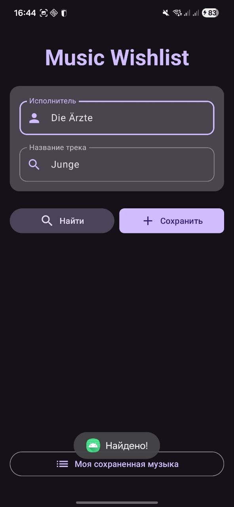

# Project Name: Music Wishlist

## Description
Music Wishlist — это мобильное приложение для Android, предназначенное для создания и ведения личной коллекции музыкальных треков. Приложение позволяет искать актуальную информацию о песнях через внешний API (iTunes Search API) и сохранять избранные композиции в локальную базу данных SQLite. Проект реализует современный многооконный пользовательский интерфейс с использованием Jetpack Compose, поддерживает фоновую работу с сетью через корутины и включает обработку тач-событий (удаление свайпом/долгим нажатием).

## Installation
Для локальной установки и запуска проекта выполните следующие шаги:
1. Склонируйте репозиторий на свой компьютер:
   `git clone git@github.com:fpmi-pmvs2026/pmvs10a-project-chififo.git`
2. Откройте скачанную папку проекта в **Android Studio** (рекомендуется версия Hedgehog и новее).
3. Дождитесь окончания синхронизации Gradle.
4. Выберите эмулятор (API 24+) или подключенное физическое устройство.
5. Нажмите кнопку **Run** (Shift + F10) для сборки и установки приложения.

## Usage
Приложение состоит из двух основных экранов, обеспечивающих полный цикл работы с музыкальной коллекцией.

### 1. Поиск и добавление треков
На главном экране введите имя исполнителя и воспользуйтесь умным поиском по сети:
* Введите имя (например, "Linkin Park") и нажмите **Найти**. Приложение в фоновом потоке сделает запрос в интернет и автоматически заполнит точное название популярного трека.
* Нажмите **Сохранить**, чтобы добавить трек в локальную базу данных.

### 2. Управление коллекцией
Перейдите по кнопке **Моя сохраненная музыка**, чтобы увидеть список всех добавленных треков.
* **Обычное нажатие** на карточку трека откроет браузер с поиском подробной информации о песне в Google.
* **Долгое нажатие** (удержание) на карточку трека удалит его из вашей базы данных (демонстрация тач-интерфейса).

## Contributing
Проект выполнен студентами группы 10а. В рамках командной работы задачи были распределены следующим образом:

* **Дмитрий Юрашевич (@m3wory)** — Тимлид проекта. 
  * Настройка репозиториев и базовой архитектуры приложения.
  * Разработка пользовательского интерфейса с использованием Jetpack Compose и Material Design 3.
  * Создание многооконного интерфейса (навигация между Activity).
  * Реализация тач-событий (Long Click) и UI-взаимодействий.
* **Елена Чиж (@gvazidra)** — Разработчик. 
  * Проектирование и реализация слоя хранения данных (чистый SQLite средствами Android SDK).
  * Интеграция сетевого взаимодействия с открытым API iTunes.
  * Настройка многопоточности (Kotlin Coroutines + Dispatchers.IO) для предотвращения блокировки главного UI-потока при сетевых запросах.